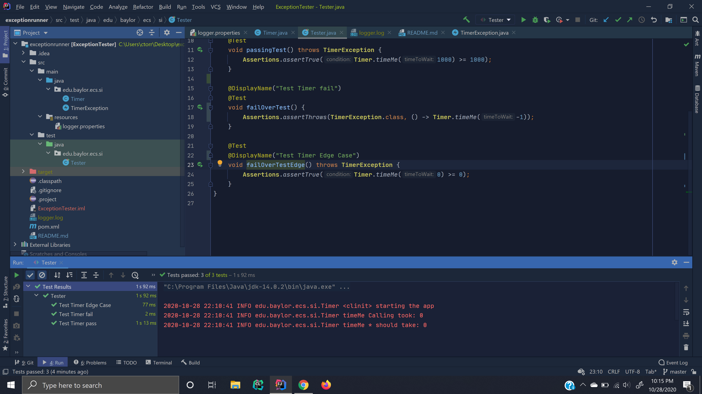
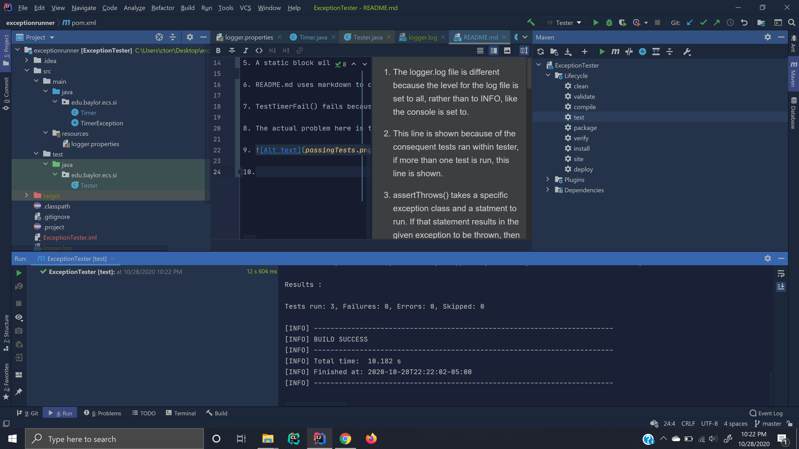

1. The logger.log file is different because the level for the log file is set to all, rather than to INFO, like the console is set to.

2. This line is shown because of the consequent tests ran within tester, if more than one test is run, this line is shown to show that is is checking for the @Disabled annotation.

3. assertThrows() takes a specific exception class and a statment to run. If that statement results in the given exception to be thrown, then the assert passes.

4.
    1. The serialization runtime uses a serialVersionUID is used during deserialization to verify that the sender and receiver of a serialized object are compatible with respect to serialization. If the receiver has a different serialVersionUID than that of the corresponding sender's class, then deserialization will result in an InvalidClassException.
    
    2. We need to override constructors because they are not inherited from the Exception class.
    
    3. We don't have to override the Exception methods because they are inherited from the Exception class and work with constructors given.
    
5. A static block will execute once and before the first call to an instance of the class, in this case the static block is used to specify the logger properties.

6. README.md uses markdown to display a normal README file that would normally be in any project. A README is a reference for other users visiting your repository and documents steps for them to get your application up and running.

7. TestTimerFail() fails because the assertThrows() encounters a NullPointerException, instead of a TimerException. This is due to the finally() block within timeMe(), that, regardless of the thrown exception, runs anyways.

8. The actual problem here is that the tests are not running in order. Generally you'd expect the tests to run in the order in which they are created.

9. 

10. 

11. TimerException is a user-defined exception and NullPointerException is a built-in exception.